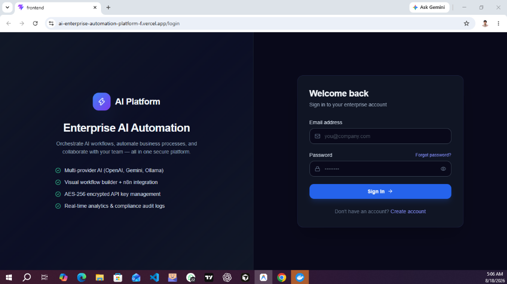
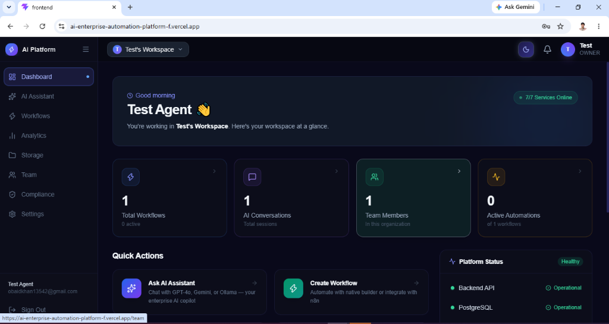
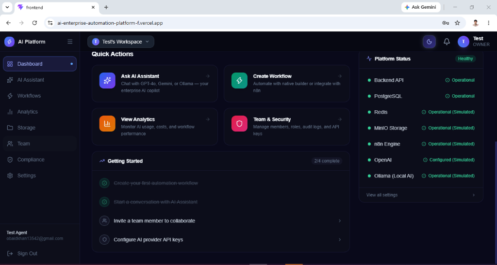
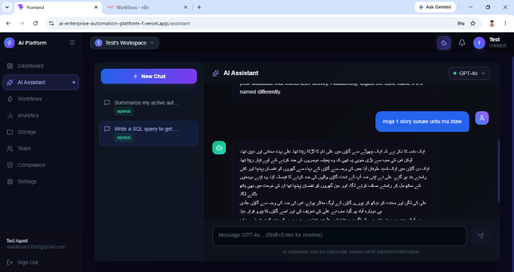
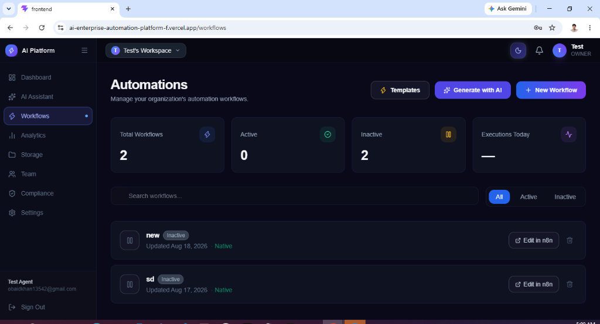
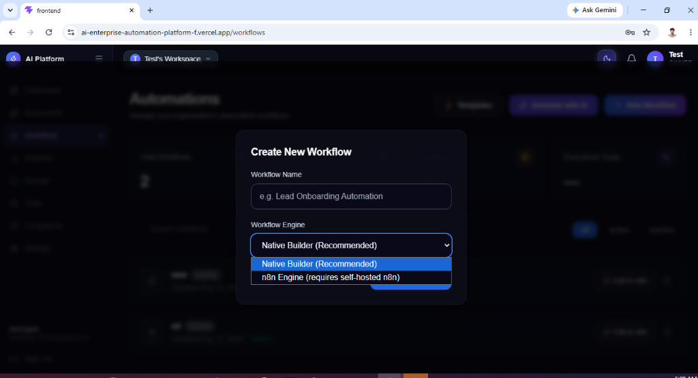
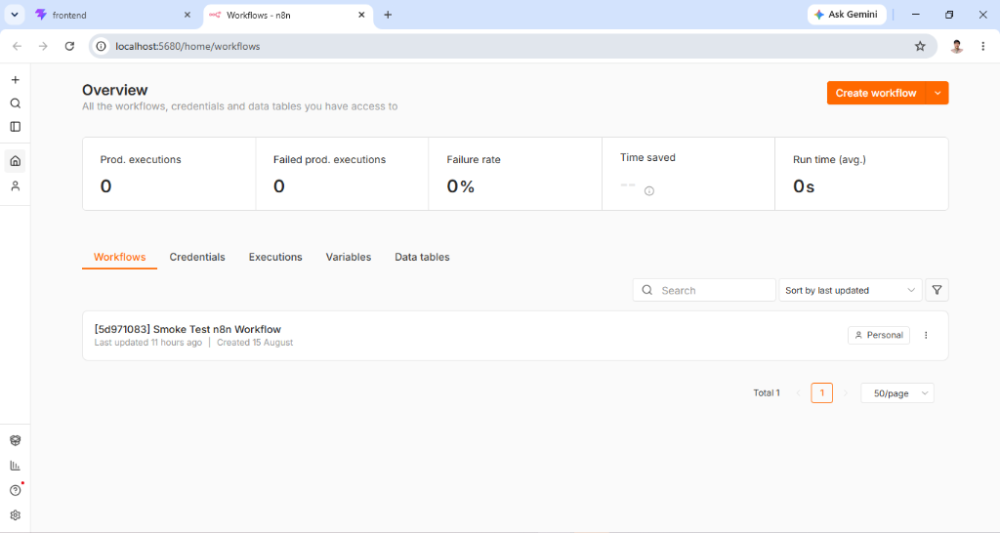
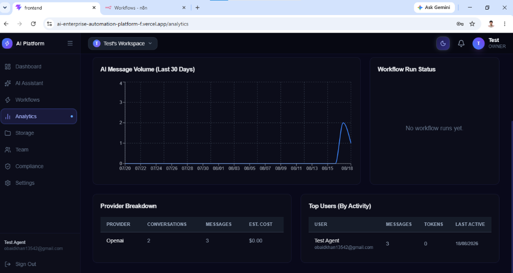

# AI Enterprise Automation Platform

<div align="center">
  
  
  <p><em>A self-hosted, multi-tenant automation platform combining conversational AI, AI-generated workflows, visual automation, n8n integration, secure document storage, analytics, and enterprise security.</em></p>
</div>

---

## 🌟 Key Features & Capabilities

### 1. Multi-Tenant Enterprise Dashboard
<div align="center">
  
  
</div>

- **Organizations & RBAC:** Users belong to isolated organizations with strict Role-Based Access Control (Owner, Admin, Manager, Member).
- **Platform Health:** Real-time monitoring of backend APIs, PostgreSQL, Redis, MinIO, and AI providers.

### 2. Multi-Provider AI Assistant
<div align="center">
  
</div>

- **Model Agnostic:** Switch seamlessly between OpenAI GPT-4o, Google Gemini 2.0 Flash, and local Ollama models.
- **Real-Time Streaming:** Uses Server-Sent Events (SSE) to stream tokens instantly to the UI, bypassing traditional HTTP timeout limits.

### 3. Dual-Engine Workflow Automation
<div align="center">
  
  <br/>
  
</div>

- **Native Engine:** A custom Breadth-First Search (BFS) executor that traverses visual graphs to execute lightweight internal workflows (HTTP, conditionals, AI actions).
- **AI Workflow Generation:** Prompt the AI in natural language to instantly generate a structured workflow graph.

### 4. Enterprise n8n Integration
<div align="center">
  
</div>

- Seamlessly create, trigger, and manage self-hosted n8n workflows for complex third-party app integrations directly from the platform.

### 5. Analytics & Compliance
<div align="center">
  
</div>

- **Analytics:** Monitor AI token consumption, estimated USD costs, message volumes, and workflow success rates.
- **Audit Logs:** Immutable tracking of system mutations (Create, Delete, Update) exportable as CSV for compliance.

---

## 🏗️ Architecture & Tech Stack

For a complete breakdown of the system architecture, data flow, and security request lifecycle, please see the **[Architecture & Threat Model](docs/architecture.md)** document.

- **Frontend:** React 18, Vite, TailwindCSS, `@xyflow/react`, Zustand.
- **Backend:** Node.js, Express 5, TypeScript, Prisma ORM.
- **Infrastructure:** Dockerized PostgreSQL 16, Redis 7, n8n, MinIO, Nginx.
- **Security:** AES-256-GCM encrypted API keys, JWT access/refresh tokens, bcrypt hashing, Helmet.js.

---

## 🚀 Quick Start (Local Development)

For detailed step-by-step instructions, see the [Windows Setup Guide](docs/WINDOWS_SETUP.md).

### 1. Start Infrastructure
```bash
cd docker
docker compose up -d
```

### 2. Start Backend
```bash
cd apps/backend
npm install
npx prisma generate
npx prisma db push
npm run dev
```

### 3. Start Frontend
```bash
cd apps/frontend
npm install
npm run dev
```
*Access the platform at `http://localhost:5174`*

---

## 📚 Documentation

Detailed documentation can be found in the `docs/` directory:
- [Product Guide](docs/PRODUCT_GUIDE.md)
- [API Overview](docs/API_OVERVIEW.md)
- [Deployment Guide](docs/DEPLOYMENT_GUIDE.md)
- [Troubleshooting](docs/TROUBLESHOOTING.md)
- [Architecture & Threat Model](docs/architecture.md)

---

## 🔒 Security Notes
- **No Hardcoded Secrets:** All credentials rely on strictly injected environment variables.
- **Encrypted Keys:** Organization-level third-party API keys (OpenAI, Gemini) are encrypted at rest using `AES-256-GCM`. The master decryption key is never stored in the database.
- **Data Isolation:** All database queries are strictly scoped using `organizationId` filters at the ORM level.

---

*This project was developed as a personal portfolio piece demonstrating full-stack enterprise software architecture.*
