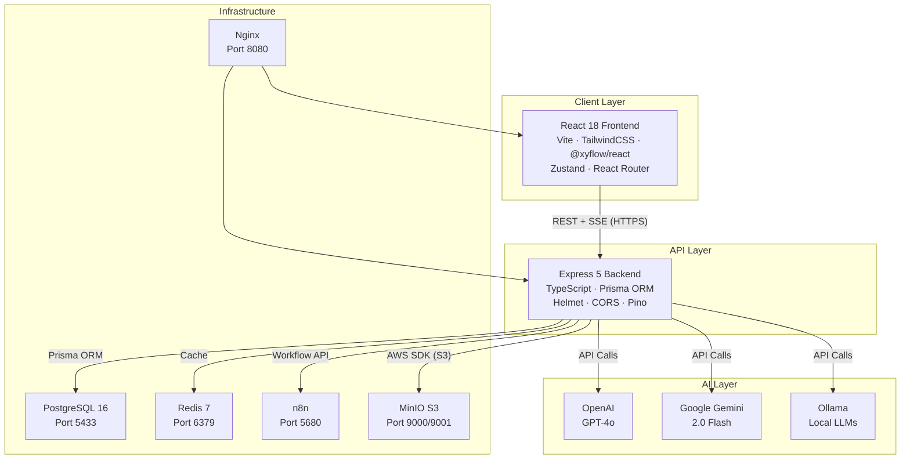
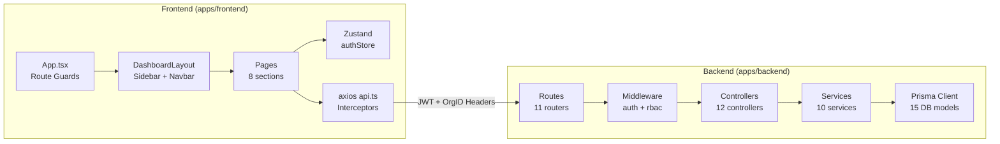
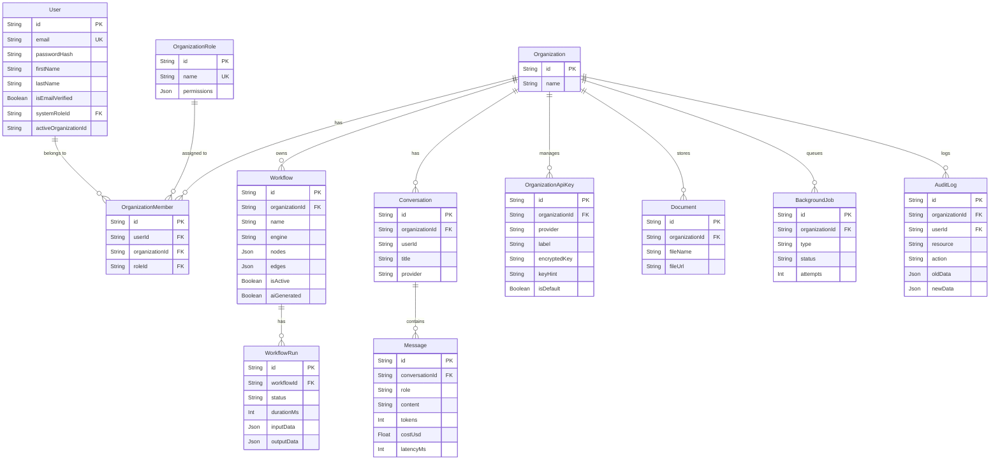
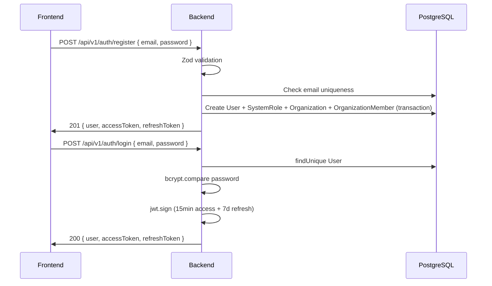
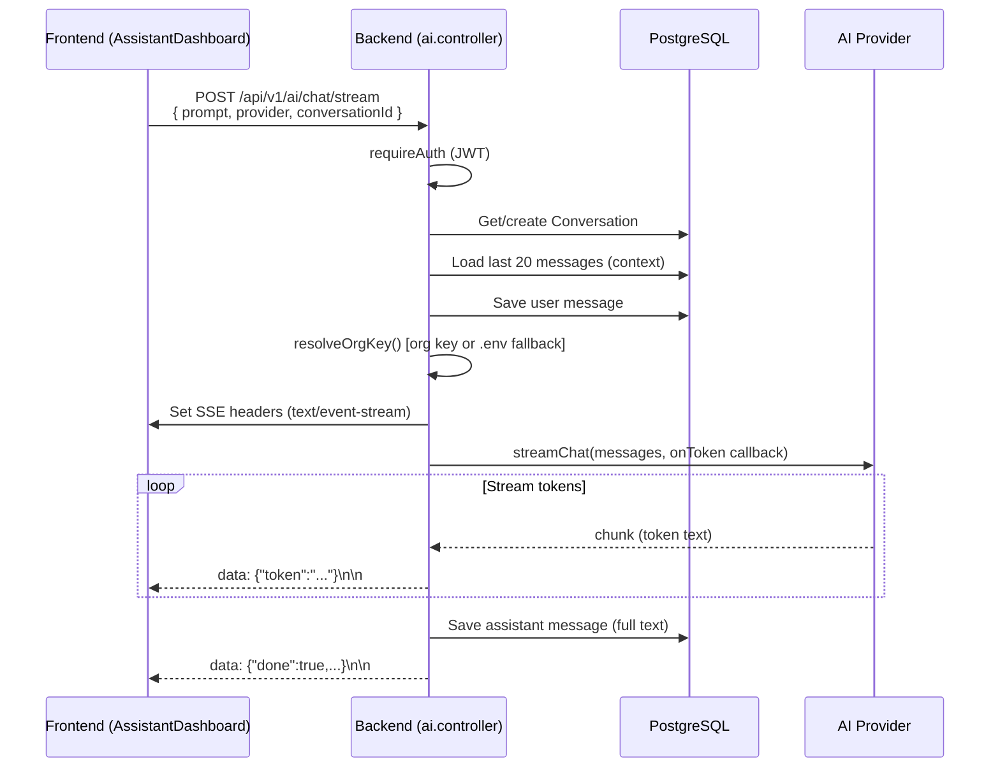
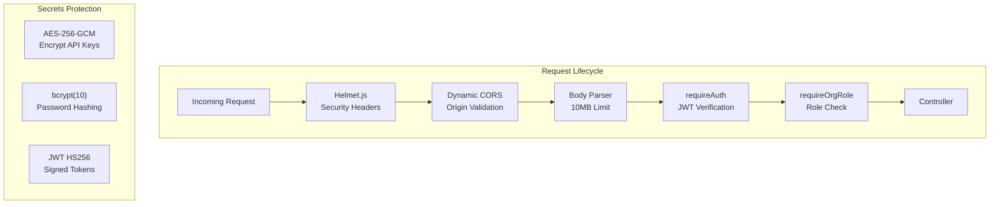

# Architecture — AI Enterprise Automation Platform

> Version 1.0.0 | Last Updated: 2026-08-18

---

## System Overview



---

## Component Architecture



---

## Database Schema



---

## Request Flow: Auth



---

## Request Flow: AI Streaming Chat



---

## Security Architecture



---

## Service Port Map

| Service | External Port | Internal Port | Container Name |
|---------|--------------|---------------|----------------|
| Frontend (dev) | 5174 | — | — |
| Backend API | 4000 | — | — |
| PostgreSQL | 5433 | 5432 | automation-postgres |
| pgAdmin | 5050 | 80 | automation-pgadmin |
| Redis | 6379 | 6379 | automation-redis |
| n8n | 5680 | 5678 | automation-n8n |
| MinIO API | 9000 | 9000 | automation-minio |
| MinIO Console | 9001 | 9001 | automation-minio |
| Nginx | 8080 | 80 | automation-nginx |
| Ollama (local) | 11434 | — | — |

---

## Deployment Architecture (Production)

```
Browser → Vercel Edge CDN
            ↓ (HTTPS)
         React App (Vercel)
            ↓ (HTTPS API calls)
         Render.com (Backend)
            ↓ (DATABASE_URL via Prisma connection pooler)
         Supabase PostgreSQL (Render Postgres)
            ↓
         External services: OpenAI · Gemini · n8n (optional)
```

- Frontend: **Vercel** (`ai-enterprise-automation-platform-f.vercel.app`)
- Backend: **Render** (`ai-enterprise-automation-platform.onrender.com`)
- Database: **Render PostgreSQL** (external via `DIRECT_URL`)

---

## Backend File Structure

```
apps/backend/src/
├── index.ts                    # Express app entry point, middleware, routes
├── middleware/
│   ├── auth.middleware.ts       # JWT verification → req.user
│   └── rbac.middleware.ts       # Org role check + audit log decorator
├── routes/                     # 11 Express routers
│   ├── auth.routes.ts          # /api/v1/auth/*
│   ├── org.routes.ts           # /api/v1/orgs/*
│   ├── workflow.routes.ts      # /api/v1/workflows/*
│   ├── ai.routes.ts            # /api/v1/ai/*
│   ├── analytics.routes.ts     # /api/v1/analytics/*
│   ├── audit.routes.ts         # /api/v1/audit-logs/*
│   ├── org-api-keys.routes.ts  # /api/v1/org-api-keys/*
│   ├── notification.routes.ts  # /api/v1/notifications/*
│   ├── documents.routes.ts     # /api/v1/documents/*
│   ├── webhook.routes.ts       # /api/v1/webhooks/:token
│   └── jobs.routes.ts          # /api/v1/jobs/*
├── controllers/               # 12 route handler files
├── services/
│   ├── ai.service.ts          # OpenAI, Gemini, Ollama providers + factory
│   ├── ai-workflow-generator.service.ts  # Prompt → workflow JSON
│   ├── analytics.service.ts   # Metrics aggregation queries
│   ├── email.service.ts       # Nodemailer (Welcome, OTP, Password Reset)
│   ├── encryption.service.ts  # AES-256-GCM encrypt/decrypt
│   ├── n8n.service.ts         # n8n REST API client
│   ├── notification.service.ts # Create DB notifications
│   ├── org-api-keys.service.ts # Org API key CRUD + validation
│   ├── storage.service.ts     # MinIO S3 upload/download
│   ├── workflow-engine.service.ts  # BFS native node executor
│   └── jobs/
│       ├── job-queue.interface.ts   # IJobQueue interface
│       ├── job-queue.service.ts     # Service singleton
│       └── postgres-queue.provider.ts  # PostgreSQL-backed queue
├── schemas/
│   ├── auth.schema.ts          # Register, Login Zod schemas
│   ├── org.schema.ts           # Org CRUD, invite Zod schemas
│   └── org-api-keys.schema.ts  # Org API key Zod schemas
└── utils/
    ├── prisma.ts               # PrismaClient singleton
    └── requestHelpers.ts       # getHeader, requireOrgHeader, getParam
```

---

## Frontend File Structure

```
apps/frontend/src/
├── App.tsx                     # BrowserRouter, Routes, ProtectedRoute guard
├── lib/
│   ├── api.ts                  # Axios instance + JWT/OrgID interceptors
│   └── utils.ts                # cn() TailwindCSS class merger
├── store/
│   └── authStore.ts            # Zustand persisted auth state
├── components/
│   └── NotificationBell.tsx    # Polling notification dropdown
├── layouts/
│   └── DashboardLayout.tsx     # Sidebar, nav, org switcher, header
└── pages/
    ├── Dashboard.tsx           # Overview metrics + recent workflows
    ├── ai/
    │   └── AssistantDashboard.tsx  # Multi-provider SSE chat UI
    ├── analytics/
    │   └── AnalyticsDashboard.tsx  # Charts, metrics, health checks
    ├── audit/
    │   └── AuditComplianceDashboard.tsx  # Filterable audit log table
    ├── auth/
    │   ├── Login.tsx           # Sign in + forgot password
    │   ├── Register.tsx        # Registration form
    │   ├── ResetPassword.tsx   # Legacy token reset
    │   ├── OtpVerification.tsx # 6-digit OTP input
    │   └── NewPassword.tsx     # New password form
    ├── documents/
    │   └── DocumentManager.tsx # File upload/list/download
    ├── settings/
    │   ├── SettingsPage.tsx    # Settings with 6 tabs
    │   └── components/
    │       ├── ApiKeyManager.tsx    # Org-level AI key management UI
    │       └── JobQueueManager.tsx  # Background job monitoring UI
    ├── team/
    │   └── TeamManagement.tsx  # Member list + role + invite
    └── workflows/
        ├── WorkflowDashboard.tsx   # Workflow list + run/delete
        ├── WorkflowBuilder.tsx     # React Flow canvas builder
        └── components/
            └── AiWorkflowWizard.tsx  # Natural language → workflow
```
