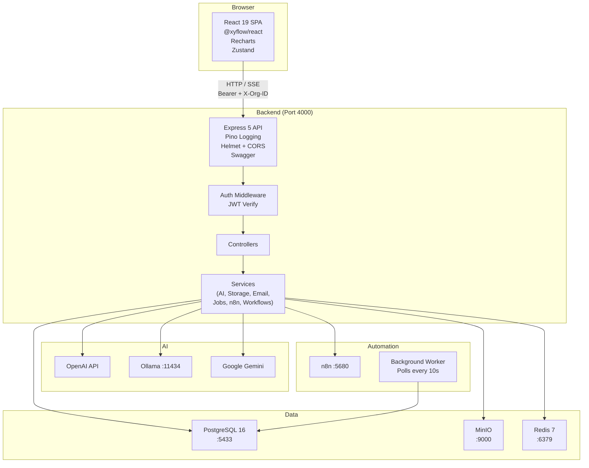

# Architecture — AI Enterprise Automation Platform

---

## 1. System Overview

The platform follows a classic three-tier architecture: a React SPA (frontend), an Express REST API (backend), and a set of infrastructure services (PostgreSQL, MinIO, Redis, n8n, Ollama). All services are containerized via Docker Compose for local development.



---

## 2. Frontend Architecture

The frontend is a **React 19 Single Page Application** built with Vite 8.

### State Management
- **Zustand** (`src/store/`) — global client state (auth user, active org, token)
- **TanStack Query v5** — server state caching (API calls, pagination, invalidation)
- **Local component state** — form state, modal open/close, transient UI

### Routing
React Router Dom v7 with two route groups:
1. **Public** — `/login`, `/register`, `/verify-otp`, `/reset-password-new`
2. **Protected** — nested under `DashboardLayout`, which checks auth and redirects if not logged in

### API Layer
`src/lib/api.ts` — Axios instance with:
- Base URL: `http://localhost:4000/api/v1`
- Interceptor: attaches `Authorization: Bearer <token>` and `X-Organization-ID` headers from Zustand store

### Key Pages
| Route | Component | Purpose |
|---|---|---|
| `/` | Dashboard | KPI summary, quick stats |
| `/assistant` | AssistantDashboard | AI chat with SSE streaming |
| `/workflows` | WorkflowDashboard | List, create, manage workflows |
| `/workflows/:id/edit` | WorkflowBuilder | React Flow visual builder |
| `/analytics` | AnalyticsDashboard | Charts, AI usage, health |
| `/audit` | AuditComplianceDashboard | Compliance audit log |
| `/documents` | DocumentManager | File upload/download/delete |
| `/settings` | SettingsPage | API keys, jobs, profile |
| `/team` | TeamManagement | Members, invitations, roles |

---

## 3. Backend Architecture

The backend follows a **Controller → Service → Data** pattern:

```
Request
  ↓ Express Router (routes/*.routes.ts)
  ↓ requireAuth middleware (JWT verify)
  ↓ Controller (controllers/*.controller.ts)
     - Validate X-Organization-ID header
     - Call checkOrgAccess(userId, orgId)
     - Call service methods
     - Return JSON response
  ↓ Service (services/*.service.ts)
     - Business logic
     - Prisma ORM calls
     - External API calls (AI, MinIO, n8n)
  ↓ Prisma (utils/prisma.ts)
  ↓ PostgreSQL
```

### Key Services
| Service | Purpose |
|---|---|
| `ai.service.ts` | AI provider abstraction (OpenAI, Ollama, Gemini) |
| `ai-workflow-generator.service.ts` | NL → workflow JSON via AI |
| `analytics.service.ts` | Usage aggregation, cost estimation |
| `email.service.ts` | Nodemailer SMTP, TEST_MODE guard |
| `n8n.service.ts` | n8n REST API proxy |
| `notification.service.ts` | Create/fetch notifications |
| `storage.service.ts` | MinIO S3 operations |
| `workflow-engine.service.ts` | BFS workflow graph execution |
| `jobs/postgres-queue.provider.ts` | PostgreSQL job queue |
| `jobs/job-queue.service.ts` | Queue singleton |

---

## 4. Multi-Tenant Data Architecture

```
Organization (Tenant)
├── Members (OrganizationMember)
│   └── User + OrganizationRole (OWNER/ADMIN/MANAGER/MEMBER)
├── Workflows
├── Conversations
├── Documents (metadata only — files in MinIO)
├── ApiKeys
├── OrganizationApiKeys (encrypted AI provider keys)
├── Notifications
├── AuditLogs
├── BackgroundJobs
└── OrganizationSettings
```

**Enforcement:**
1. Every Prisma query includes `{ where: { organizationId } }`
2. The `X-Organization-ID` header is parsed by `requireOrgHeader(req)` helper
3. `checkOrgAccess(userId, organizationId)` verifies the user is a member — throws `Forbidden` if not

---

## 5. Authentication Flow

```
Register:
  POST /auth/register
  → Zod validate
  → bcrypt.hash(password, 10)
  → tx: create User + Organization + OrganizationMember (OWNER)
  → update User.activeOrganizationId
  → generateTokens(userId)  ← JWT access (15m) + refresh (7d)
  → sendWelcomeEmail (async, non-fatal)
  → return { accessToken, refreshToken, user }

Login:
  POST /auth/login
  → findUser by email
  → bcrypt.compare(password, hash)
  → generateTokens(userId)
  → return { accessToken, refreshToken, user }

OTP Reset:
  POST /auth/forgot-password-otp
  → rate limit (3/15min)
  → invalidate old OTPs
  → crypto.randomInt(100000, 999999)
  → bcrypt.hash(otp, 10)
  → store PasswordResetOtp (expires 10min)
  → sendOtpEmail

  POST /auth/verify-otp
  → find valid, unexpired record
  → brute-force guard (max 5 attempts)
  → bcrypt.compare(otp, otpHash)
  → issue resetToken (15min)

  POST /auth/reset-password-otp
  → validate resetToken
  → bcrypt.hash(newPassword, 12)
  → tx: update User.passwordHash + mark OTP used
```

---

## 6. RBAC Enforcement

```typescript
// 1. JWT middleware
requireAuth(req, res, next)  // verifies Bearer token, sets req.user

// 2. Organization header
const organizationId = requireOrgHeader(req)  // reads X-Organization-ID

// 3. Membership check
await checkOrgAccess(userId, organizationId)  
// → prisma.organizationMember.findFirst({ where: { userId, organizationId } })
// → throws Error('Forbidden') if not found

// 4. Role-level checks (in controllers)
const membership = await prisma.organizationMember.findFirst({
  where: { userId, organizationId },
  include: { role: true }
});
const roleName = membership.role.name;
if (roleName !== 'OWNER' && roleName !== 'ADMIN') {
  return res.status(403).json({ ... });
}
```

---

## 7. AI Provider Abstraction

```typescript
abstract class AIProvider {
  abstract generateText(prompt: string): Promise<string>
  abstract generateChatResponse(messages: ChatMessage[]): Promise<string>
  abstract generateChatResponseWithUsage(messages): Promise<{response, tokensUsed, latencyMs}>
  abstract streamChatResponse(messages, onToken: (token: string) => void): Promise<void>
}

class OllamaProvider extends AIProvider { /* HTTP to :11434 */ }
class OpenAIProvider extends AIProvider { /* openai SDK */ }
class GeminiProvider extends AIProvider { /* @google/generative-ai */ }

class AIService {
  getProvider(name, apiKey?) → AIProvider instance
  chat(provider, messages, options) → Promise<string>
  chatWithUsage(provider, messages) → Promise<{response, tokensUsed, costUsd, latencyMs}>
  streamChat(provider, messages, onToken) → Promise<void>
}
```

---

## 8. Workflow Engine

```
execute(workflowId, triggerData):
  1. Load Workflow from DB (nodes, edges as JSON)
  2. Create WorkflowRun { status: 'RUNNING', inputData: triggerData }
  3. Find trigger node (type.startsWith('trigger_'))
  4. BFS queue = [triggerNode.id]
  5. While queue not empty:
     a. Dequeue nodeId
     b. Skip if already visited
     c. Execute node handler by type
     d. Store result in context[nodeId]
     e. Enqueue connected nodes (or branch on condition)
  6. Update WorkflowRun { status: COMPLETED|FAILED, outputData: context, durationMs }
  7. Return { success, run, logs, context }

Node handlers:
- trigger_webhook / trigger_manual → return trigger context
- action_email    → template + log (email simulation)
- action_http     → Axios HTTP request
- action_ai       → AIService.chat()
- logic_condition → evaluate condition → branch edges
- default         → warn + return error
```

---

## 9. n8n Integration

```typescript
class N8nService {
  client: AxiosInstance  // baseURL: N8N_URL/api/v1

  constructor() {
    // API key injected per-request via interceptor
    this.client.interceptors.request.use(config => {
      config.headers['X-N8N-API-KEY'] = process.env.N8N_API_KEY || '';
      return config;
    });
  }

  createWorkflow(name): Promise<{id, ...}>
  listWorkflows(): Promise<WorkflowList>
  deleteWorkflow(id): Promise<void>
}
```

n8n workflow IDs stored on the `Workflow` model. "Open in n8n" links: `${N8N_URL}/workflow/${n8nWorkflowId}`.

---

## 10. Storage Architecture (MinIO)

```
Upload:
  POST /api/v1/documents (multipart/form-data)
  → Multer (memory storage)
  → S3 PutObjectCommand { Bucket, Key: 'org/{orgId}/{uuid}_{filename}', Body: buffer }
  → Prisma Document.create { organizationId, uploadedBy, fileName, fileUrl, mimeType, size }
  → AuditLog { action: 'UPLOAD' }

Download:
  GET /api/v1/documents/:id/download
  → Find Document
  → S3 GetObjectCommand → getSignedUrl (presigned, time-limited)
  → Return { downloadUrl }

Delete:
  DELETE /api/v1/documents/:id
  → S3 DeleteObjectCommand
  → Prisma Document.delete
  → AuditLog { action: 'DELETE' }
```

---

## 11. Background Job System

```
PostgresQueueProvider:
  enqueue(type, payload, options):
    → prisma.backgroundJob.create { status: 'PENDING', maxAttempts: 3 }

  start():
    → setInterval(poll, 10000)  // every 10 seconds

  poll():
    → findMany { status: 'PENDING', type in registeredHandlers, take: 5 }
    → For each: updateMany { where: {id, status:'PENDING'}, data: {status:'RUNNING', attempts: +1} }
    → If updated.count > 0: executeJob(job)

  executeJob(job):
    → handler(job)
    → Update { status: 'COMPLETED', completedAt }
    → On error: Update { status: isFinalAttempt ? 'FAILED' : 'PENDING', error }
```

Optimistic locking via `updateMany` prevents duplicate job processing.

---

## 12. Docker Infrastructure

```yaml
services:
  postgres:   postgres:16-alpine    # Port 5433:5432, healthcheck
  pgadmin:    dpage/pgadmin4        # Port 5050:80
  redis:      redis:7-alpine        # Port 6379:6379
  n8n:        n8nio/n8n             # Port 5680:5678, uses PostgreSQL DB
  minio:      minio/minio           # Port 9000:9000, 9001:9001
  nginx:      nginx:alpine          # Port 8080:80

volumes: postgres_data, pgadmin_data, redis_data, n8n_data, minio_data
```

All services use named volumes to persist data across restarts. n8n shares the PostgreSQL database instance.
