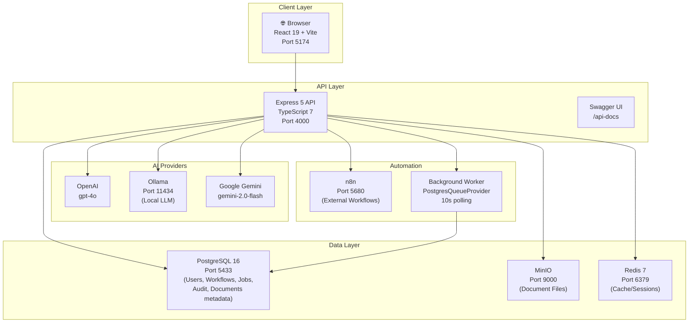

# AI Enterprise Automation Platform — Project Proposal

**Version:** 1.0  
**Status:** Feature Complete — READY WITH UNTESTED USER-FACING FLOWS  
**Date:** August 2026

---

## 1. Executive Summary

The AI Enterprise Automation Platform is a full-stack, multi-tenant SaaS application that unifies AI-powered chat, visual workflow automation, document storage, analytics, audit compliance, and background job processing into a single self-hosted deployment. It is designed to enable enterprise teams to automate business processes, interact with multiple AI providers, and maintain complete operational oversight — all within their own infrastructure.

---

## 2. Problem Statement

Enterprise teams face fragmentation when adopting AI and automation:

- AI tools are siloed (ChatGPT, Gemini, local LLMs) with no unified interface
- Workflow automation (n8n, Zapier) requires separate accounts and context-switching
- Document storage and AI context are disconnected
- There is no unified audit trail for compliance
- Background operations (email, processing) have no visibility
- Multi-team access control is inconsistent or non-existent

This platform solves all of these problems in a single, self-hosted, organization-scoped application.

---

## 3. Project Goals

1. Provide a unified AI assistant supporting multiple providers (OpenAI, Ollama, Gemini)
2. Enable visual workflow building with a drag-and-drop canvas
3. Integrate with n8n for external workflow automation
4. Allow natural language → workflow generation via AI
5. Implement organization-scoped document storage with MinIO
6. Provide real-time analytics on AI usage, costs, and workflow execution
7. Maintain a complete audit trail for enterprise compliance
8. Support multi-tenancy with fine-grained RBAC
9. Process background jobs reliably using PostgreSQL as the queue backend

---

## 4. Target Users

- **Enterprise Teams** seeking a self-hosted AI automation hub
- **Developers** building internal tools with AI and workflow capabilities
- **Compliance Teams** requiring audit trails and access control
- **Operations Teams** managing documents and automated processes
- **Managers** needing visibility into AI usage and costs

---

## 5. Functional Requirements

- User registration, login, JWT authentication, OTP password reset
- Multi-organization support with member invitations and role assignment
- AI chat with OpenAI, Ollama, and Gemini; SSE streaming
- Visual workflow builder with trigger, action, condition, and AI nodes
- n8n workflow creation and management proxy
- AI-generated workflows from natural language prompts
- Webhook-triggered native workflow execution
- Document upload, download, delete with MinIO
- Platform health monitoring and analytics dashboard
- Audit log with filtering, detail view, and CSV export
- Notification bell with unread count
- PostgreSQL-backed background job processing
- Per-organization encrypted AI provider key management

---

## 6. Non-Functional Requirements

- **Security:** bcrypt, JWT, AES-256-GCM encryption, Helmet.js, CORS
- **Scalability:** Stateless Express backend, horizontal scaling ready
- **Maintainability:** TypeScript throughout, Prisma ORM, modular services
- **Observability:** Pino structured logging, health endpoints, audit trail
- **Reliability:** Background job retries, graceful error handling
- **Developer Experience:** Hot reload (tsx watch + Vite HMR), Swagger docs

---

## 7. System Architecture



---

## 8. Technology Stack

| Category | Technology | Version |
|---|---|---|
| Frontend | React | 19 |
| Build Tool | Vite | 8 |
| Language (FE) | TypeScript | 6 |
| Styling | TailwindCSS | 3 |
| Workflow Canvas | @xyflow/react | 12 |
| State | Zustand | 5 |
| Server State | TanStack Query | 5 |
| Charts | Recharts | 3 |
| Animations | Framer Motion | 12 |
| Backend | Express | 5 |
| Language (BE) | TypeScript | 7 |
| ORM | Prisma | 5.14 |
| Database | PostgreSQL | 16 |
| Object Storage | MinIO | latest |
| Auth | jsonwebtoken + bcrypt | 9/6 |
| Email | Nodemailer | 9 |
| OpenAI | openai SDK | 7 |
| Gemini | @google/generative-ai | 0.24 |
| Logging | Pino | 10 |
| Containerization | Docker Compose | latest |
| Workflow Automation | n8n | latest |
| Local LLM | Ollama | latest |

---

## 9. Database Architecture

The platform uses **PostgreSQL 16** via **Prisma ORM 5.14**.

### Key Models

| Model | Purpose |
|---|---|
| `User` | Platform users, system roles, active org reference |
| `SystemRole` | System-level roles (e.g., `user`, `superadmin`) |
| `Organization` | Tenant container — every resource belongs to an org |
| `OrganizationRole` | OWNER, ADMIN, MANAGER, MEMBER with JSON permissions |
| `OrganizationMember` | User↔Organization membership with role |
| `OrganizationInvitation` | Pending invitations with expiry |
| `OrganizationSetting` | Per-org key/value settings |
| `Workflow` | Native and n8n workflows with nodes, edges, webhookToken |
| `WorkflowRun` | Execution records with PENDING/RUNNING/COMPLETED/FAILED |
| `Conversation` | AI chat sessions per org/user |
| `Message` | Individual chat messages with token/cost/latency data |
| `Document` | File metadata (MinIO object stored separately) |
| `ApiKey` | API keys (platform-level) |
| `OrganizationApiKey` | Per-org encrypted AI provider keys |
| `Notification` | User/org notifications with read status |
| `ActivityLog` | Low-level activity tracking |
| `AuditLog` | Compliance-grade audit records with old/new data |
| `BackgroundJob` | PostgreSQL-backed job queue |
| `PasswordResetToken` | Legacy token-based password reset |
| `PasswordResetOtp` | OTP-based password reset with rate limiting |

---

## 10. Multi-Tenant Architecture

Every resource in the platform is scoped to an `organizationId`:

1. **Registration** automatically creates a new organization (personal workspace)
2. Every API request to protected resources requires an `X-Organization-ID` header
3. The backend validates the user is a member of that organization before any operation
4. Prisma queries always filter by `organizationId`
5. MinIO objects are stored under `org/{organizationId}/...` paths

This ensures complete data isolation between tenants.

---

## 11. Authentication

### Registration Flow
1. User submits email, password, firstName, lastName, organizationName
2. Zod validates the payload
3. bcrypt hashes the password (cost 10)
4. A transaction creates: User, Organization, OrganizationMember (OWNER role)
5. `activeOrganizationId` is set on the user
6. JWT access (15 min) + refresh (7 day) tokens returned
7. Welcome email sent asynchronously

### Login Flow
1. Email/password submitted
2. User looked up by normalized email
3. bcrypt compared against stored hash
4. JWT tokens generated and returned

### OTP Password Reset Flow
1. `POST /auth/forgot-password-otp` — generates 6-digit OTP, bcrypt-hashed, stored in `PasswordResetOtp`
2. OTP emailed via SMTP (rate limited: 3 per 15 min)
3. `POST /auth/verify-otp` — compares OTP (max 5 attempts), issues short-lived `resetToken` (15 min)
4. `POST /auth/reset-password-otp` — validates resetToken, hashes new password (cost 12), marks OTP used

---

## 12. RBAC

### Roles

| Role | Permissions |
|---|---|
| `OWNER` | Full access to everything (`["*"]`) |
| `ADMIN` | Manage members, view audit logs, all resources |
| `MANAGER` | Manage workflows, documents, AI (no audit/org settings) |
| `MEMBER` | Read own data, use AI, view documents |

### Enforcement

- `requireAuth` middleware validates JWT on all protected routes
- `checkOrgAccess(userId, organizationId)` helper verifies membership
- Role-specific checks inside controllers (e.g., OWNER/ADMIN only for audit logs)
- `X-Organization-ID` header required for all org-scoped endpoints

---

## 13. AI Provider Architecture

```
AIProvider (abstract class)
├── generateText(prompt): Promise<string>
├── generateChatResponse(messages): Promise<string>
├── generateChatResponseWithUsage(messages): Promise<{response, tokensUsed, latencyMs}>
└── streamChatResponse(messages, onToken): Promise<void>

Implementations:
├── OllamaProvider    — local LLM via HTTP
├── OpenAIProvider    — OpenAI SDK, gpt-4o
└── GeminiProvider    — Google Generative AI SDK, gemini-2.0-flash

AIService (facade)
├── chat(provider, messages, options)
├── chatWithUsage(provider, messages, options) → {response, tokensUsed, costUsd, latencyMs}
└── streamChat(provider, messages, onToken, options)
```

---

## 14. AI Assistant

- Users select a provider (OpenAI, Ollama, Gemini) in the UI
- Messages are stored per Conversation with token usage and cost
- Streaming via `POST /api/v1/ai/chat/stream` — Server-Sent Events (SSE)
- Non-streaming via `POST /api/v1/ai/chat`
- Conversation history loaded via `GET /api/v1/ai/conversations`
- Per-org AI provider key management allows custom API keys

---

## 15. AI Streaming (SSE)

The backend uses native Node.js SSE:
1. `res.setHeader('Content-Type', 'text/event-stream')`
2. Each AI token is sent as `data: <token>\n\n`
3. A final `data: [DONE]\n\n` signals completion
4. The frontend accumulates tokens and renders progressively

---

## 16. Native Workflow Engine

### Node Types

| Type | Action |
|---|---|
| `trigger_webhook` | Entry point for webhook-triggered flows |
| `trigger_manual` | Entry point for manual execution |
| `action_email` | Simulate/send email (logged) |
| `action_http` | HTTP request to external URL |
| `action_ai` | AI prompt execution via provider |
| `action_log` | Log output to context |
| `logic_condition` | Branch on true/false condition |

### Execution

1. BFS (breadth-first search) graph traversal from trigger node
2. Each node receives the execution `context` (including all previous node outputs)
3. Template variables `{{nodeId.field}}` are resolved at execution time
4. `WorkflowRun` record created as `RUNNING`, updated to `COMPLETED` or `FAILED`
5. Full context and error details stored in the run record

---

## 17. n8n Integration

- `N8nService` wraps the n8n REST API via Axios
- API key injected via request interceptor (reads `N8N_API_KEY` at call time)
- Workflow creation: `POST /api/v1/workflows` with `engine: 'n8n'` → proxied to n8n
- The n8n workflow ID is stored in `Workflow.n8nWorkflowId`
- "Open in n8n" links: `${N8N_URL}/workflow/${n8nWorkflowId}`

---

## 18. AI Workflow Generation

1. User enters natural language prompt in UI
2. `POST /api/v1/workflows/generate` sends prompt to AI provider
3. AI returns structured React Flow-compatible JSON (nodes + edges)
4. Frontend shows **Preview** screen (name, description, AI explanation, node diagram)
5. User clicks **Approve & Build** → `POST /api/v1/workflows` with `aiGenerated: true`
6. Controller logs `AI_WORKFLOW_GENERATED` in `AuditLog`
7. Workflow opens in the Visual Builder

---

## 19. Webhooks

1. Every native workflow is created with a unique `webhookToken` (16-byte random hex)
2. Webhook URL: `POST /api/v1/webhooks/{webhookToken}`
3. The controller checks `workflow.isActive === true` before executing
4. The POST body, query, and headers are injected into the execution context
5. A `WorkflowRun` is created and updated asynchronously
6. Response returns `202 Accepted` immediately

---

## 20. Analytics

### Overview Endpoint
Returns: conversations total/monthly, messages total/monthly/avg, workflows total/active, workflow runs total/monthly, members, tokens all-time/monthly, cost estimates, avg AI latency.

### Health Endpoint
Checks: backend, PostgreSQL, Redis, MinIO, n8n, OpenAI config, Ollama availability.

---

## 21. Audit & Compliance

- `AuditLog` model stores: userId, organizationId, resource, action, oldData, newData, createdAt
- Access restricted to OWNER and ADMIN roles
- Filtering by resource, action, date range
- Pagination support
- View Details shows JSON diff of oldData vs newData
- CSV export via `GET /api/v1/audit-logs?format=csv`

### Logged Actions
- `CREATE` — Workflow created
- `AI_WORKFLOW_GENERATED` — AI-generated workflow confirmed
- `DELETE` — Workflow or document deleted
- `UPLOAD` — Document uploaded
- Organization membership changes

---

## 22. Document Storage

- Files stored in MinIO under `org/{organizationId}/{uuid}_{filename}`
- Metadata stored in PostgreSQL `Document` table
- Upload: multipart form → Multer → S3 PutObject → Document record → AuditLog
- Download: `GET /api/v1/documents/:id/download` → presigned URL (time-limited)
- Delete: S3 DeleteObject → Document delete → AuditLog

---

## 23. MinIO

MinIO is deployed via Docker Compose as an S3-compatible object store:
- API on port 9000
- Console on port 9001
- Private bucket (`documents`) — not publicly accessible
- AWS SDK (`@aws-sdk/client-s3`, `@aws-sdk/s3-request-presigner`) used for all operations

---

## 24. Notifications

- `Notification` model: id, organizationId, userId, type, title, message, isRead, createdAt
- Types: SUCCESS, ERROR, INFO, WARNING
- Retrieved via `GET /api/v1/notifications` with `unreadCount`
- Notifications created by background jobs and system events
- Mark as read via update endpoint

---

## 25. PostgreSQL Background Jobs

See [BACKGROUND_JOBS_AND_NOTIFICATIONS.md](./BACKGROUND_JOBS_AND_NOTIFICATIONS.md).

---

## 26. Security Model

See [SECURITY_AND_RBAC.md](./SECURITY_AND_RBAC.md).

---

## 27. API Architecture

- REST API under `/api/v1/`
- All routes require JWT via `Authorization: Bearer <token>` header
- Org-scoped routes require `X-Organization-ID` header
- Zod validation on all request bodies
- Pino structured logging on all requests
- Swagger documentation at `/api-docs`

### Route Groups
- `/auth` — Authentication
- `/orgs` — Organization management
- `/org-api-keys` — Encrypted AI provider keys
- `/workflows` — Native and n8n workflows
- `/webhooks` — Webhook triggers
- `/ai` — AI chat and conversations
- `/analytics` — Platform health and usage
- `/audit-logs` — Compliance audit
- `/documents` — File storage
- `/notifications` — Notification system
- `/jobs` — Background job management

---

## 28. Frontend Architecture

- React 19 SPA with React Router Dom 7
- Zustand for auth/user state (persisted)
- TanStack Query for server state caching
- Axios API client in `src/lib/api.ts`
- React Flow (`@xyflow/react`) for workflow canvas
- Recharts for analytics charts
- Framer Motion for animations
- Radix UI for accessible components
- React Hook Form + Zod for form validation
- SSE handled via native `EventSource` / `fetch` with `responseType: stream`

### Pages
- `/login`, `/register` — Auth
- `/verify-otp`, `/reset-password-new` — OTP Reset
- `/` — Dashboard
- `/assistant` — AI Assistant
- `/workflows` — Workflow Dashboard
- `/workflows/:id/edit` — Visual Builder
- `/analytics` — Analytics
- `/audit` — Audit & Compliance
- `/documents` — Document Storage
- `/team` — Team Management
- `/settings` — Settings (API keys, jobs, profile)

---

## 29. Docker Architecture

All infrastructure services run via `docker/docker-compose.yml`:

| Service | Image | Ports | Volume |
|---|---|---|---|
| `postgres` | postgres:16-alpine | 5433:5432 | postgres_data |
| `pgadmin` | dpage/pgadmin4 | 5050:80 | pgadmin_data |
| `redis` | redis:7-alpine | 6379:6379 | redis_data |
| `n8n` | n8nio/n8n | 5680:5678 | n8n_data |
| `minio` | minio/minio | 9000/9001 | minio_data |
| `nginx` | nginx:alpine | 8080:80 | — |

---

## 30. Development Workflow

```
1. docker compose up -d       # Start infrastructure
2. cd apps/backend && npm run dev   # Backend with tsx watch
3. cd apps/frontend && npm run dev  # Frontend with Vite HMR
4. Edit code → auto-reload
5. Run smoke tests: node scratch/smoketest.js
```

---

## 31. Testing Strategy

- TypeScript compilation (`npx tsc --noEmit`) as static analysis
- Prisma schema validation
- Lint (0 errors via oxlint)
- API smoke tests (`scratch/smoketest.js`, `scratch/smoketest-advanced.js`)
- Manual browser testing for UI flows
- See [TESTING_AND_VERIFICATION.md](./TESTING_AND_VERIFICATION.md)

---

## 32. Deployment Strategy

See [DEPLOYMENT_AND_OPERATIONS.md](./DEPLOYMENT_AND_OPERATIONS.md).

---

## 33. Current Status

**READY WITH UNTESTED USER-FACING FLOWS**

All backend APIs verified. All builds passing. Known verification gaps are browser/UI interactions that cannot be automated without Playwright or a browser.

---

## 34. Known Limitations

1. OTP email flow cannot be end-to-end verified without a mock inbox mechanism
2. React Flow drag/drop interactions require browser automation (Playwright)
3. AI SSE streaming UI requires browser-level testing
4. Webhook execution requires `isActive=true` — workflows must be activated manually
5. No automated unit tests or integration test suite yet
6. n8n API key must be manually generated from the n8n UI

---

## 35. Future Improvements

See [FUTURE_ROADMAP.md](./FUTURE_ROADMAP.md).

---

## 36. Final Conclusion

The AI Enterprise Automation Platform is a feature-complete, production-architecture application that demonstrates the full stack of modern enterprise software: multi-tenant authentication, AI provider abstraction, visual workflow automation, document management, analytics, compliance, and background processing — all deployed via Docker and built with TypeScript throughout.

The platform is ready for handoff with all backend APIs verified, all builds passing, and comprehensive documentation complete.
